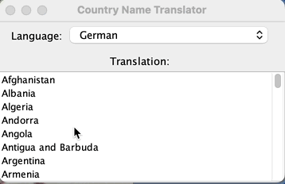
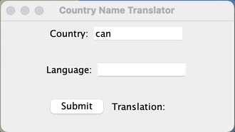

# Lab 3: Team Task: Country Translation Program 

---

## Program Overview
This program is a country name translation program. The user should be able
to select a country, pick a language, and immediately see the translation.

Currently, the program is only partially complete, but we have left TODOs
indicating what is left to be implemented. Today, your team's task is to
get it working and demonstrate that it works.

---

## Requirements:
To receive credit for today's team activity, your team must:
- **demo your working code to your TA**
  - full marks if the program demonstrates full functionality (see demo later in the readme)
  - no marks if the program is clearly incomplete
---

- [X] **To get started, have one member of your team make a fork of this
repo on GitHub and add each other team member as a collaborator. This
will allow you to make and review pull requests from each other
during the lab.**

---

## Part 1: Maven Project
Build systems are used to help programmers more easily
compile, run, and test their programs. In this lab, we'll be using Maven to
organize and build our program.

### Project Structure
Take a second to get familiar with how this project is structured. Maven projects
are structured in a specific way, which isn't too different from what we have seen so far:
- `pom.xml`: the Project Object Model (POM) xml file which contains the project configuration
  (IntelliJ automatically detects this file and runs maven commands to build the project for us)
- `src/main/java`: directory containing the source files for our project
  (note that it is automatically marked as the Sources Root)
- `src/main/resources`: directory containing any resource files our project needs
- `src/test/java`: directory containing the test files for our project
  (note that it is automatically marked as the Test Sources Root)

> Note: sometimes you may need to right-click the `pom.xml` file and select `Maven -> Reload project' if you 
> don't see the sources root folders marked automatically.

> For those interested, you can read the Maven documentation to learn about the `mvn` commands
> (like Git, Maven has a command line interface!)
> but for our purposes you can use the IntelliJ interface to run and test your code as you have been doing. 
> See the Quercus page for this lab for links to additional resources.

#### Managing Dependencies
The main reason we want to introduce Maven today is that we'll be using an
external library to help us read JSON data. The `pom.xml` file allows us to specify
what external dependencies our project requires. If you open
`pom.xml`, you will see a section like below. It indicates that our project depends
on the `junit` and `json` libraries. Additionally, the second entry for `org.json` is there
to download the javadoc for the `json` library so that we can access the documentation
for any of its code as we work.

```xml
<dependencies>
    <!-- https://mvnrepository.com/artifact/org.json/json -->
    <dependency>
        <groupId>org.json</groupId>
        <artifactId>json</artifactId>
        <version>20240303</version>
    </dependency>
    <dependency>
        <groupId>org.json</groupId>
        <artifactId>json</artifactId>
        <version>20240303</version>
        <classifier>javadoc</classifier>
        <optional>true</optional>
    </dependency>
    
    <dependency>
        <groupId>org.junit.jupiter</groupId>
        <artifactId>junit-jupiter</artifactId>
        <version>5.8.1</version>
        <scope>test</scope>
    </dependency>
</dependencies>
```
Maven will automatically download these libraries for us. In the `Project Tool Window`,
you can see the `External Libraries` listed.

When adding dependencies, you can use websites like https://mvnrepository.com to find
what entry you need to add to your `pom.xml` in order to add the dependency to your project.

For example, the `json` dependency was obtained from https://mvnrepository.com/artifact/org.json/json/20240303.
You'll also see that you can select other formats for the dependency information if you are
using a different build system, such as Gradle.

### Running your code and tests
Take a second to ensure that you are able to run everything that you need to in the project.

- Confirm that you can run `GUI.java`.

- Confirm that you can run the tests by right-clicking the `src/test/java` folder and selecting "Run 'All Tests'".
  No tests will initially pass, but they will by the end of this lab.

If either of these aren't able to run, ask for help from your team or your TA. Make sure
to carefully read any error messages.

> Note: sometimes you may need to right-click the `pom.xml` file and select `Maven -> Reload project' if
> the project doesn't seem to be loading properly.

---

## Part 2: The Translation Program
We are now ready to start writing some new code for the program!

- **The overall goal is to have a functional program that looks something like below.**



To achieve this goal, your team needs to complete all "TODO" comments in the project files.
You can use the TODO Tool Window to see all remaining TODOs at a glance.

The following provides some of the background information that will help you
complete the implementation.

### JSON

JSON provides a way to represent objects in a simple key-value pair format. Since the format is standard,
languages like Java have libraries that allow us to conveniently read and write JSON data.

> Note: There is some nice discussion of various options for parsing JSON at
> https://stackoverflow.com/questions/2591098/how-to-parse-json-in-java. Today, we'll use a specific library in Java,
> but you are welcome to explore others in future which offer richer functionality and better performance.

#### A first example

Consider the following JSON data:

```json
[{"key1" : "string1a", "key2":21}, {"key1" : "string1b", "key2":22}] 
```

The `[]` denote a JSON array and `{}` denote a JSON object. These can be nested, but
for this example we have a single array with two objects in it. Each object
contains two key-value pairs.

There is an example of how to extract the various data provided in `JSONDemo.java`.

- **Read `src/main/java/org/translation/JSONDemo.java` and predict what the code
  will output before running it to confirm.**

#### Understanding our data
Open the `src/main/resources/sample.json` file. It contains the JSON data we'll be
using for this program. It is like the small example we just saw, but contains many more entries.
Each object will have exactly the same keys as listed below:
- `"id"`: an integer uniquely identifying each object
- `"alpha2"`: two character string country code (we will NOT use this key at all)
- `"alpha3"`: three character string country code (we will use this key!)
- 35 other keys corresponding to 35 different languages; each key is a language code

Note that this data is all in terms of **country codes** and **language codes**, which aren't likely
that intuitive for a user of our program. To help our users, we'll also use data from
`src/main/resources/country-codes.txt` and `src/main/resources/language-codes.txt`.

These other two data files are tab (`"\t"`) delimited and contain mappings between English
names of countries/languages and their corresponding codes.
Using these files, we can create methods to convert from the codes
to the full country or language names. These will be what
we actually display to the user of our program. In the starter code,
the program works purely in terms of country codes and language codes as demonstrated below:



- Open each of these files to see what kind of information they
contain. Notice that each of the `.txt` files contains a header row at the top,
which is ignored when reading the data.

- [X] **As a team, complete the `TODO Task 1` in `CanadaTranslator` to get familiar with
  the data we are working with in this activity.**

Once your team completes this task, you should be able to run the GUI and translate
to the two new languages that were implemented!

---

## Tasks A, B, and C
These three sets of TODO tasks relate to the actual translation, converting
language codes, and converting country codes.

- [X] **Divide up these three tasks across your team and complete them. We recommend working in pairs for these tasks, with each pair making
  a PR, but you can also subdivide these tasks.**

> Once these are implemented, the provided tests should all pass.

---

### The GUI (Task D)

- [ ] **As a team, complete the ``TODO Task D``**

For the improved UI, you'll notice that there is a dropdown menu of languages and a scrollable list of country names.
Each time one of these items is selected, the UI updates to show the translation. The new components used in the UI
are `JComboBox` and `JList`. You can see examples of their usage in the `examples` package or refer to the official
documentation.

To get the whole application working, the `GUI` will need to make use of the services provided by an implementation of
the `Translator` interface. The `CountryCodeConverter` and `LanguageCodeConverter` classes will also be
needed to help convert country codes and language codes.

> Your team is welcome to define new classes if you decide that would make it easier to achieve
> a functional demo during the lab.

This part will require more code than the previous tasks, so your team will either want to work together or divide
the work across pairs to work on (e.g., decide on a set of issues and assign them to team members).
For example, one pair might work on updating which translator is being used, while
another pair gets the `JList` of country names added.

> The UI doesn't have to be *exactly* what the example shows, but it should be pretty close. E.g., if your group decided
> to use `JList` for the country names and languages that would be fine too.

## Demo
 - [ ] **Once your team's code is fully functional,
demo your program to your TA to verify that your team has completed this lab activity.**

---

## Common Bugs
As you work on the implementation, you may run into bugs.
Below are a few common ones and how to fix them. In general,
you should be able to use the debugger to identify and resolve any bugs.

- problem: inconsistent capitalization of language or country codes.
    - solution: make sure the codes are always lowercase.

- problem: the translation isn't working
    - solution: make sure you are using the country and language codes
      and have finished implementing the various classes; once the
      UI is in terms of the actual country names and languages, make
      sure your program is properly converting these to codes.

---

---

## Data Sources
The data used here comes from:
- https://stefangabos.github.io/world_countries/
- https://en.wikipedia.org/wiki/List_of_ISO_639_language_codes
  - Chinese (Taiwan): zh-tw added from https://www.andiamo.co.uk/resources/iso-language-codes/
- https://www.iban.com/country-codes
